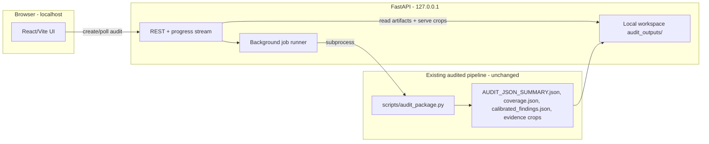

# Local Self-Audit Web App + Writing/Submission Module

> Roadmap / design plan. A local-first web app (FastAPI + React/Vite) that wraps the existing
> audit pipeline so ordinary researchers can prepare a package, run an integrity audit, and read
> an interactive report - plus a clearly-separated "Writing & Submission Readiness" module for
> grammar and pre-submission checks that never mixes into the R0-R4 integrity risk register.

## Guiding principles (carry the project's ethos into the UI)

- Local-first: bind to `127.0.0.1`, nothing uploaded; a persistent "runs on your machine, nothing leaves this device" banner. Any network feature (external literature search, DOI/retraction lookups, LLM grammar) is explicit opt-in, mirroring the existing privacy-aware default in [scripts/audit_package.py](../scripts/audit_package.py).
- Do not destabilize the audited core: the backend invokes the existing, validated CLI ([scripts/audit_package.py](../scripts/audit_package.py)) via subprocess (exactly how CI/tests already call it) and reads the JSON artifacts. No changes to detectors/calibrators in P0.
- Preserve restraint: no integrity "score", no PASS/FAIL, no gauges. Keep R0-R4 and neutral language. The UI must never render verdict language; it consumes `misconduct_verdict_present: false` and surfaces the `audit_coverage` scope note so "no findings != clean" stays front and center.
- Hard separation: writing/grammar findings live in their own module and never roll into the integrity findings or any combined score.

## V0.5 status

V0.5 implements the P0 path plus the highest-leverage package-prep P1 slice: a local FastAPI job
runner, artifact API, React/Vite report viewer, package scaffold/inspection tools, a visual
assembly-manifest builder, and launcher. The CLI now writes submission-QC artifacts and a basic
HTML/PDF report export inside `submission_qc_packet/`; dedicated web UI tabs/buttons for those
artifacts are still future work. It intentionally does not include network reference checks or
desktop packaging yet.

Implemented files:

- [`webapp/backend/app.py`](../webapp/backend/app.py) - FastAPI app, background subprocess jobs,
  artifact API, package prep/manifest endpoints, safe evidence serving, guarded zip extraction,
  history/delete.
- [`webapp/frontend`](../webapp/frontend) - React/Vite UI for coverage, R0-R4 findings,
  positive provenance evidence, missing materials, evidence crops, package prep, manifest rows,
  and bilingual labels.
- [`webapp/README.md`](../webapp/README.md) - run and scope notes.

## Architecture

The V0.5 backend is a thin job-runner + artifact server with package-prep helpers. The integrity
result is whatever the existing pipeline produces, surfaced faithfully. Writing/submission
features are later modules and must remain separate from integrity findings.
The package-prep endpoints write declarations and directory scaffolds only; they do not validate,
clear, or reinterpret integrity candidates.

## Repository layout (new)

- `webapp/backend/` - FastAPI app (Python 3.10+), reuses `requirements.txt` plus `fastapi`, `uvicorn`.
- `webapp/frontend/` - React + Vite + TypeScript.
- `webapp/README.md` + a launcher (`python -m webapp` or `webapp/run.sh`) that starts uvicorn and opens the browser.

## Backend (FastAPI) - P0 plus package-prep P1

Endpoints (read existing artifacts; never recompute risk):
- `POST /api/audits` - body: local package path or uploaded zip, `mode`, `domains`, external-lit provider (default offline). Starts a background subprocess audit; returns `audit_id`.
- `GET /api/audits/{id}` - status + progress (parse stdout/`pipeline_summary.json`).
- `GET /api/audits/{id}/summary` - serves `AUDIT_JSON_SUMMARY.json` + `coverage.json` + `calibrated_findings.json`.
- `GET /api/audits/{id}/evidence/{relpath}` - serves crops from `audit_outputs/<id>/evidence/...` produced by [detectors/image/local_patch_reuse.py](../detectors/image/local_patch_reuse.py).
- `GET /api/audits/{id}/report.md` - Markdown export. PDF/self-contained HTML export is P1.
- `POST /api/packages/inspect` - inventories a local package path and returns recommended folder,
  file-role, scan-warning, and existing `assembly_manifest.csv` state. Inventory is bounded by
  file count and directory depth to avoid accidentally scanning a whole home/workspace tree.
- `POST /api/packages/scaffold` - creates the recommended package folders without deleting or
  overwriting supplied materials.
- `POST /api/packages/assembly-manifest` - writes `figure_assembly/assembly_manifest.csv` after
  package-relative path, relation-type, and source-role validation.

Security constraints:
- Serve evidence only from the current audit's `evidence/` directory; reject absolute paths, empty path segments, and `..`.
- For uploaded zips, extract into an independent local workspace with size/member limits and path-traversal checks.
- Keep local package paths and uploaded package workspaces separate from output artifacts.

## Frontend (React) - P0 report viewer plus package prep

- Coverage/scope banner (top, always visible): modules executed vs not, image panels screened, unreadable image files, scope note - straight from the `audit_coverage` block.
- Risk register: filter by R0-R4 and module; each finding expands to its evidence ledger (benign explanations, required materials, recommended action) from `calibrated_findings.json`.
- Evidence-crop viewer: side-by-side image diff for image findings, using the already-exported crops.
- Positive Provenance Evidence panel from `positive_provenance`; Missing Materials checklist from `materials_missing`.
- Package Prep panel: inspect/scaffold a package and write declared figure-to-source relationships
  to `figure_assembly/assembly_manifest.csv`; the UI labels these as declarations requiring
  later cross-checking, not verified provenance.
- Bilingual scaffold (中/EN) since the audience is Chinese-speaking researchers; link out to [docs/self-audit-guide.md](self-audit-guide.md).

## P1 - the features that make it usable for non-developers

- Re-audit and diff UI: CLI diff artifacts exist via `scripts/compare_audit_runs.py` and
  `scripts/audit_package.py --compare-to`; the web app now exposes the selected re-audit diff.
  The web app also exposes a correction-plan tracker generated from [skill/biomed-research-integrity-auditor/templates/presubmission-correction-plan.md](../skill/biomed-research-integrity-auditor/templates/presubmission-correction-plan.md); inline browser editing remains open.
- Export UI for CLI-generated submission QC packets now exposes packet downloads and key files.
  HTML/PDF polish and author-signoff editing remain open.

## P1/P2 - Writing & Submission Readiness module (separate tab, fenced)

On-brand, integrity-adjacent checks first (higher value than raw grammar):
- Interactive reporting-standard checklists (ARRIVE/CONSORT/MIFlowCyt/omics) generated from [skill/biomed-research-integrity-auditor/references/biomed-module-checklists.md](../skill/biomed-research-integrity-auditor/references/biomed-module-checklists.md), auto-prefilled where the pipeline already detects signals (randomization/blinding mentions, n reporting, accession presence).
- Submission-readiness checklist: data/code availability, ethics/IRB statement, COI, funding, ORCID, author contributions.
- Reference and citation integrity: DOI resolution/metadata prompts are implemented through opt-in Crossref-style checks. Retraction Watch coverage and reference-list vs in-text consistency remain open.
- Statistical-reporting completeness and figure/table callout consistency.

Then grammar (P2, clearly labeled "writing quality, not integrity"):
- Default engine: LanguageTool self-hosted/local (no upload). Optional LLM via user-provided key with an explicit "this sends text to an external service" opt-in.

## Extra user-need ideas worth including

- Plain-language explainer per finding ("what this means / why it matters / what to provide") for non-experts.
- Journal/funder profile presets (e.g., Nature image-integrity policy, ICMJE) that tune checklists.
- Author-query-letter generator for response-to-concern mode (template already at [skill/biomed-research-integrity-auditor/templates/author-query-letter.md](../skill/biomed-research-integrity-auditor/templates/author-query-letter.md)).
- Local audit history/workspace management and a "delete this audit" action.

## Testing

- Backend: pytest API tests using [examples/minimal_package](../examples/minimal_package) and [examples/full_presubmission_package](../examples/full_presubmission_package); assert the API exposes the same `overall_risk`/findings as the artifacts (no mutation), that `audit_coverage` is always present, and `misconduct_verdict_present` stays false.
- Frontend: component tests + one Playwright smoke run auditing an example package.
- Keep the existing 62-test suite green; add a contract test that the writing module's output is never merged into integrity findings.

## Risks and trade-offs

- Positioning dilution from grammar - mitigated by strict module separation and labeling.
- Image-diff/audit latency on large real packages (known O(N^2) cost) - run in background, stream progress, set resolution/size limits.
- Two stacks to maintain (Python + JS) - keep the frontend lightweight and the backend a thin wrapper.

## Suggested sequencing

- P0 (make the existing pipeline usable by non-devs): backend job-runner + artifact API + React report viewer + local launcher.
- P1 (close the loop): web UI for re-audit/diff, QC-packet export/download, reporting-standard + submission-readiness checklists.
- P2 (writing depth + network checks): grammar engine, reference/DOI/retraction checks, stats-completeness, journal presets, optional desktop packaging.

## Implementation checklist

- [x] Create `webapp/backend` FastAPI app bound to 127.0.0.1, add fastapi/uvicorn deps, and a launcher that opens the browser.
- [x] Implement background audit jobs that invoke `scripts/audit_package.py` via subprocess and expose create/poll/status endpoints.
- [x] Add endpoints to serve `AUDIT_JSON_SUMMARY.json`, `coverage.json`, `calibrated_findings.json`, and evidence crop images from the local workspace.
- [x] Build the React report viewer: coverage banner, R0-R4 risk register with evidence ledger, side-by-side evidence-crop viewer, positive-provenance and missing-materials panels, bilingual scaffold.
- [x] Add the local launcher, persistent local-first/privacy banner, and audit history/delete.
- [x] Build the visual figure-to-raw/source assembly-manifest builder that writes `figure_assembly/assembly_manifest.csv`, plus a package-prep wizard.
- [x] Add CLI re-audit diff artifacts.
- [x] Add CLI submission-QC packet with report HTML/PDF exports.
- [x] Add web UI re-audit/R-level diff surface and correction-plan tracker download/read surface; inline browser editing remains open.
- [x] Add web UI claim-coverage and QC-packet download surfaces for CLI-generated artifacts.
- [x] Build the separate Writing & Submission Readiness module v1 for submission-readiness prompts, fenced from integrity findings.
- [x] Add opt-in DOI/reference metadata prompts; retraction-database checks and reference vs in-text consistency remain open.
- [ ] Add grammar/language checking (local LanguageTool default; optional LLM via user key with explicit opt-in), clearly labeled as writing quality, not integrity.
- [x] Add backend API tests using example packages and path/zip safety checks.
- [x] Add lightweight webapp smoke coverage for served frontend entry plus package-prep endpoints.
- [x] Add a frontend Playwright smoke test.
- [x] Add a contract test that writing output never merges into integrity findings when the writing module exists; keep the existing suite green.
